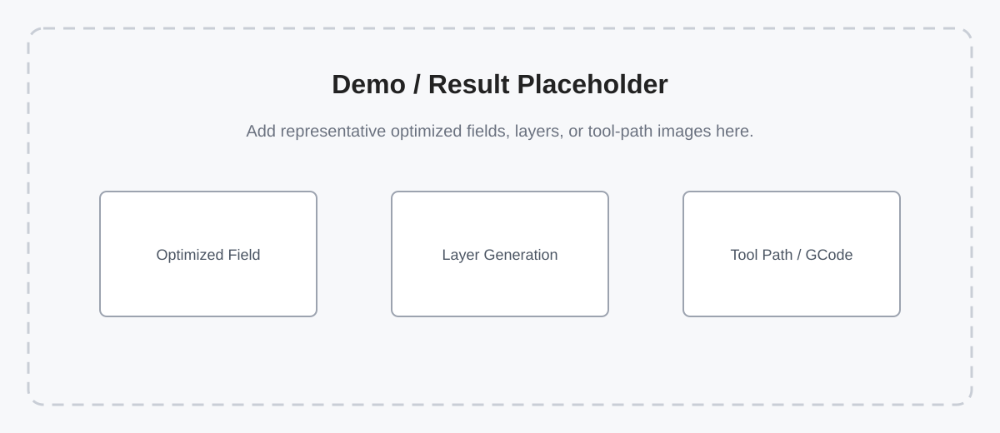

# Field Optimization for Scalable and Distortion-Aware Process Planning in Hybrid Additive-Subtractive Manufacturing


Yongxue Chen, Tao Liu, Aoran Lyu, Yu Jiang, Neelotpal Dutta, and Charlie C.L. Wang, "[Field Optimization for Scalable and Distortion-Aware Process Planning in Hybrid Additive-Subtractive Manufacturing](TODO)", TODO venue / preprint, TODO year.  
[[Project](TODO)] [[Paper](TODO)] [[Video](TODO)]

## Abstract
This paper presents a field-based optimization method for process planning in hybrid manufacturing, where the goal is to determine a feasible and efficient sequence of additive and subtractive operations for fabricating a target shape. Existing approaches rely on deterministic or discretized formulations, which lead to unoptimized fabrication time and make planning sensitive to voxel resolution. They also do not explicitly account for distortion in intermediate structures formed during manufacturing. To address these limitations, we represent manufacturing states using continuous fields, which scale naturally to models with large dimensions and fine geometric features while enabling smoother fabrication sequences. Based on this representation, we formulate process planning as a numerical optimization problem under multiple objectives, including final shape completeness, intermediate structural strength, manufacturing time, self-supporting and collision-free. Experimental results show that our method can generate distortion-aware process plans on a variety of models while substantially reducing fabrication time through up to a 72.6\% reduction in the volume of extra support.

## Repository Scope
This repository provides a PyTorch implementation of the continuous field optimization framework. Given an input STL model, the pipeline prepares support-aware geometry, builds voxel and/or neural SDF geometry representations, imports an initial operation field produced by the companion voxel-based planner, optimizes neural manufacturing fields, and postprocesses the optimized network into layers and tool paths.

The initial solution is generated by the voxel-based inverse-operation planner from the companion repository:

- `Yongxue-Chen/hybManuAccEro`: https://github.com/Yongxue-Chen/hybManuAccEro

This repository focuses on the continuous neural-field optimization stage and the downstream hybrid postprocessing stage. The trainable manufacturing fields use instant-NGP-style multi-resolution hash encodings implemented through `tiny-cuda-nn`. Large experiment outputs, training checkpoints, STL datasets, and generated GCode are intentionally excluded from the source release.

## Installation and Environment Setup

The primary setup below targets the NVIDIA GeForce RTX 5090 (Blackwell, compute capability 12.0). Create a clean environment and keep the PyTorch CUDA runtime, CUDA compiler, and `tiny-cuda-nn` target architecture aligned.

```bash
# 1. Create and activate the environment
conda create -n fieldopt_hm_rtx5090 python=3.10 pip git -y
conda activate fieldopt_hm_rtx5090

# 2. Install PyTorch for CUDA 13.0
python -m pip install torch --index-url https://download.pytorch.org/whl/cu130

# 3. Install the matching CUDA compiler/development toolkit
conda install -c nvidia cuda-nvcc=13.0 cuda-toolkit=13.0 -y

# 4. Configure the Conda CUDA 13 layout
export CUDA_HOME=$CONDA_PREFIX
export PATH=$CUDA_HOME/bin:$PATH
export CPATH=$CUDA_HOME/targets/x86_64-linux/include${CPATH:+:$CPATH}
export LIBRARY_PATH=$CUDA_HOME/targets/x86_64-linux/lib${LIBRARY_PATH:+:$LIBRARY_PATH}
nvcc --version

# 5. Install compatible build helpers
# tiny-cuda-nn currently imports pkg_resources (removed in setuptools >= 81),
# while PyTorch 2.13 requires setuptools >= 77.
python -m pip install setuptools==80.9.0 wheel ninja

# 6. Build tiny-cuda-nn for Blackwell sm_120
git clone --recursive https://github.com/NVlabs/tiny-cuda-nn
cd tiny-cuda-nn
git checkout 749dd70c5afc5a9dadb85e5652ed65d55e0ba187
git submodule update --init --recursive
cd bindings/torch
export TCNN_CUDA_ARCHITECTURES=120
export WITH_NINJA=1
export MAX_JOBS=8
python -m pip install . --no-build-isolation
cd ../../../

# 7. Install this repository's Python dependencies
python -m pip install -r requirements.txt

# 8. Verify the installation
python -c "import torch; print('Torch:', torch.__version__, 'CUDA:', torch.version.cuda, 'GPU:', torch.cuda.get_device_name(0))"
python -c "import tinycudann, trimesh, pyvista, mesh_to_sdf, manifold3d; print('Core dependencies OK')"
```

After reopening a terminal, reactivate the environment. The CUDA target paths are needed when rebuilding CUDA extensions; normal project runtime only needs the activated environment.

```bash
conda activate fieldopt_hm_rtx5090
export CUDA_HOME=$CONDA_PREFIX
export PATH=$CUDA_HOME/bin:$PATH
export CPATH=$CUDA_HOME/targets/x86_64-linux/include${CPATH:+:$CPATH}
export LIBRARY_PATH=$CUDA_HOME/targets/x86_64-linux/lib${LIBRARY_PATH:+:$LIBRARY_PATH}
```

### Tested Environment

The commands above were tested from a newly created environment on 2026-07-18:

- OS: Ubuntu 24.04.4 LTS, Linux 6.17
- Conda environment: `fieldopt_hm_rtx5090`
- Python: `3.10.20`
- GPU: NVIDIA GeForce RTX 5090
- NVIDIA driver: `595.71.05`
- CUDA compute capability: `12.0`
- `TCNN_CUDA_ARCHITECTURES`: `120`
- PyTorch: `2.13.0+cu130`
- Torch CUDA runtime: `13.0`
- CUDA compiler: `nvcc 13.0.88`
- `tiny-cuda-nn`: `2.0`, source commit `749dd70c5afc5a9dadb85e5652ed65d55e0ba187`, native `_120_C` binding
- Key geometry packages: `trimesh 4.12.2`, `pyvista 0.48.4`, `pyvistaqt 0.12.0`, `manifold3d 3.5.2`, `mesh-to-sdf 0.0.15`, `embreex 4.4.0`, `rtree 1.4.1`, `libigl 2.6.2`
- Other tested packages: `numpy 2.2.6`, `PySide6 6.11.1`, `open3d 0.19.0`, `optuna 4.9.0`, `siren-pytorch 0.1.7`

## Usage

The full workflow consists of eight stages. The config file is created first because several later scripts load manufacturing parameters, normalization scale, model capacity, loss weights, and time limits from `configs/config_multi_field_<model>.py`.

Each demo stage is designed to run independently:

- `model_data/` contains the author-provided input for every stage. These files are the stable reference data and are not overwritten by the demo commands.
- `demo_runs/` contains outputs generated by the user while testing the README commands. This directory is disposable and ignored by Git.
- A later demo stage reads its input from `model_data/`, not from the output produced by the preceding demo stage.

### 1. Create a Config File
The included bracket demo already uses `configs/config_multi_field_bracket.py`, so no new config is needed. Run all bracket commands with:

```bash
--model_name bracket
```

For any other model, create a matching config file. The `<model>` part must match the `--model_name` argument used by the scripts:

```bash
cp configs/config_multi_field_template.py configs/config_multi_field_your_model.py
```

Then use `--model_name your_model` for that model.

Edit the model config before running the pipeline. At minimum, check these values:

- `MAX_TIME`: the maximum value of the time domain, determined by the initial solution.
- `SCALE`: the target manufacturing size, corresponding to the longest edge of the model AABB.
- `WEIGHTS`: the weights assigned to the individual loss terms.
- `MANU_CONFIG`: the dimensions and parameter configuration of the manufacturing tools, especially `SMToolParas`.

The filename must follow `configs/config_multi_field_<model>.py`. The repository keeps `configs/__init__.py` so `configs` is an explicit Python package for imports such as `configs.config_multi_field_bracket`.

### 2. Prepare the Target Model and Optionally Run Preprocessing

Place the target STL under `model_data/target_shapes/`. The preprocessing program is optional. You may skip it and use the original target STL directly in the later voxelization or implicit-representation steps.

Run preprocessing only when the workflow needs removable supports, or when you want to test support generation. It produces a normalized body, removable supports, a combined body-and-support model, and a support-removal plan by performing the following operations:

1. Loads and validates the target mesh.
2. Translates the minimum corner of its AABB to the origin and scales its longest AABB edge to `1.0`.
3. Detects downward-facing overhang regions and samples support seed points.
4. Generates collision-aware removable supports using the tool parameters from the model config.
5. Boolean-unions the body and supports, repairs the exported meshes, and creates the ordered support-removal plan.

Default preprocessing input:

```text
model_data/target_shapes/<model>.stl
```

Default preprocessing test output:

```text
demo_runs/preprocessed/<model>/
```

#### Run the bracket demo

The repository already provides the bracket config and target STL:

```text
configs/config_multi_field_bracket.py
model_data/target_shapes/bracket.stl
```

From the repository root, run the default preprocessing demo command:

```bash
conda run -n fieldopt_hm_rtx5090 python preprocess.py --model_name bracket
```

This reads the provided target STL and writes newly generated test results to:

```text
demo_runs/preprocessed/bracket/
```

The generated files are `bracket_body_only.stl`, `bracket_support_only.stl`, `bracket_support.stl`, and `bracket_removal_plan.json`.

These files are optional test outputs. Later demo stages do not require them and can use the provided original bracket STL directly.

#### Adjust the overhang sampling density

The number of support seed points is controlled by `SAMPLE_DENSITY` near the top of `fieldopt/preprocessing/pre_main.py`:

```python
SAMPLE_DENSITY = 3000
```

The preprocessor computes the approximate number of seed points as:

```text
number of seeds = max(int(overhang area × SAMPLE_DENSITY), 10)
```

Increase `SAMPLE_DENSITY` when overhang regions do not receive enough supports. Decrease it when the supports are unnecessarily dense or preprocessing takes too long. Doubling the value approximately doubles the number of sampled support seeds for the same model.

A practical starting range is `1500` to `6000`: try `3000` first, inspect `<model>_support_only.stl`, and then adjust gradually. After changing the value, rerun the same preprocessing command; the files under `demo_runs/preprocessed/<model>/` are regenerated.

Or specify the input STL and output location explicitly:

```bash
conda run -n fieldopt_hm_rtx5090 python preprocess.py \
    --model_name bracket \
    --input-stl model_data/target_shapes/bracket.stl \
    --output-root demo_runs/preprocessed
```

`--output-root` is the parent directory that collects preprocessing results for multiple models. The program automatically appends `/<model_name>` to it. For example, `--output-root demo_runs/preprocessed` with `--model_name bracket` writes to `demo_runs/preprocessed/bracket/`.

Use `--output-dir` only when you want to provide the exact output directory yourself. It overrides the automatically constructed `<output-root>/<model_name>` path:

```bash
conda run -n fieldopt_hm_rtx5090 python preprocess.py \
    --model_name bracket \
    --input-stl model_data/target_shapes/bracket.stl \
    --output-dir demo_runs/preprocessed/bracket_test
```

The preprocessing outputs and their contents are:

```text
demo_runs/preprocessed/<model>/<model>_body_only.stl     normalized target body without supports
demo_runs/preprocessed/<model>/<model>_support_only.stl  generated removable supports without the body
demo_runs/preprocessed/<model>/<model>_support.stl       boolean union of the normalized body and supports
demo_runs/preprocessed/<model>/<model>_removal_plan.json ordered support-removal positions and tool axes
```

### 3. Create an Implicit Representation

The project provides two built-in implicit geometry representations:

- **Voxel implicit representation**: voxelizes the STL and saves a pure-PyTorch `H_gpu` artifact. Downstream code selects it with `--geometry_backend voxel_artifact`.
- **SIREN SDF representation**: trains a neural signed-distance field and saves a checkpoint. Downstream code selects it with `--geometry_backend siren` or `--geometry_backend neural_sdf`.

Both representations are loaded through the same geometry-backend interface and can be used by later training, evaluation, and postprocessing code. The voxel representation is the default and simplest option because it does not require neural-network training.

The bracket demo uses the author-provided preprocessed body-and-support model:

```text
model_data/preprocessed/bracket/bracket_support.stl
```

This file is provided under `model_data/`, so the third-step demo does not depend on the user running the optional preprocessing step. Results produced by the second-step demo remain under `demo_runs/` and are not used here.

#### Option A: voxel implicit representation (default)

Run the quick voxel demo:

```bash
conda run -n fieldopt_hm_rtx5090 python build_voxel_implicit.py \
    --model_name bracket \
    --stl_path model_data/preprocessed/bracket/bracket_support.stl \
    --voxel_resolution 128 \
    --output_path demo_runs/implicit_representations/bracket/bracket_voxel_implicit.pt
```

The demo uses resolution `128` so it finishes quickly. Increase `--voxel_resolution` for a finer production representation. The generated artifact can be selected by later commands with:

```bash
--geometry_backend voxel_artifact \
--geometry_artifact_path demo_runs/implicit_representations/bracket/bracket_voxel_implicit.pt
```

#### Option B: SIREN SDF representation

Run a short SIREN training job to verify checkpoint generation:

```bash
conda run -n fieldopt_hm_rtx5090 python -m fieldopt.geometry.sdf.train_sdf \
    --stl model_data/preprocessed/bracket/bracket_support.stl \
    --output-path demo_runs/implicit_representations/bracket/bracket_siren_sdf.pt \
    --epochs 2 \
    --batch_size 4096 \
    --n_surf 2048 \
    --n_vol 2048 \
    --val_samples 512
```

This short run tests the complete training, saving, loading, and query path; it is not intended to produce an accurate production SDF. For production use, increase the epoch and sample counts. The checkpoint can be selected by later commands with:

```bash
--geometry_backend siren \
--geometry_artifact_path demo_runs/implicit_representations/bracket/bracket_siren_sdf.pt
```

### 4. Generate the Initial Field with `hybManuAccEro`
The initial solution is generated by the companion voxel-based planner:

```text
https://github.com/Yongxue-Chen/hybManuAccEro
```

Use `hybManuAccEro` to process the voxelized model and generate an operation schedule / initial field. Place the converted output under:

```text
initialFields/<model>/
```

The current pretraining script expects files named like:

```text
initialFields/<model>/<model>_res<resolution>_initial_fields.txt
initialFields/<model>/<model>_res<resolution>_centers.txt
```

### 5. Update the Config Time Horizon
After the initial field is generated, update the model config with the final planning horizon from the initial solution. In the code this time horizon is currently represented by `MAX_TIME` in:

```text
configs/config_multi_field_<model>.py
```

This corresponds to the `tEnd`/end-time value used by the optimization pipeline. If `MAX_TIME` is too small, the normalized second time field can become invalid; if it is much too large, training becomes unnecessarily loose.

### 6. Pretrain
Pretraining initializes the neural fields from the voxelized geometry and the initial field.

```bash
conda run -n fieldopt_hm_rtx5090 python main_pre_train.py --model_name bracket
```

### 7. Optimize
Run Bayesian optimization to search loss weights and call the main continuous optimizer:

```bash
conda run -n fieldopt_hm_rtx5090 python bayesian_weight_optimizer.py --model_name bracket
```

Or run the main optimizer directly:

```bash
conda run -n fieldopt_hm_rtx5090 python main_optimize.py --model_name bracket
```

### 8. Evaluate and Postprocess
Evaluate a trained checkpoint:

```bash
conda run -n fieldopt_hm_rtx5090 python evaluate_model.py \
    --model_name bracket \
    --model_path output/bracket_final_trained.pth \
    --batch_size 65536 \
    --n_batches 20 \
    --output_json output/bracket_eval_results.json
```

Generate layers and paths:

```bash
conda run -n fieldopt_hm_rtx5090 python postprocess.py \
    --model_name bracket \
    --model_path output/bracket_final_trained.pth
```

> TODO: confirm the final public postprocessing command once demo checkpoints and configs are fixed.

## Geometry Backend
Training, evaluation, Bayesian optimization, and postprocessing share the same geometry backend loader in `fieldopt/geometry/backend.py`.

Available backends:

- `voxel_artifact`: load a saved voxel `H_gpu` artifact; this is the recommended default.
- `voxel`: rebuild the voxel implicit function directly from STL.
- `siren` / `neural_sdf`: load a trained neural SDF checkpoint.

Examples:

```bash
# Use the saved voxel artifact generated by the third-step demo
conda run -n fieldopt_hm_rtx5090 python main_optimize.py \
    --model_name bracket \
    --geometry_backend voxel_artifact \
    --geometry_artifact_path demo_runs/implicit_representations/bracket/bracket_voxel_implicit.pt

# Rebuild voxel geometry from STL
conda run -n fieldopt_hm_rtx5090 python main_optimize.py \
    --model_name bracket \
    --geometry_backend voxel

# Use neural/SIREN SDF geometry
conda run -n fieldopt_hm_rtx5090 python main_optimize.py \
    --model_name bracket \
    --geometry_backend siren \
    --geometry_artifact_path demo_runs/implicit_representations/bracket/bracket_siren_sdf.pt
```

## Input and Output Formats

All model-specific inputs and generated artifacts are organized under `model_data/`. Generated artifacts should use a model-named subdirectory so files from different models remain separate:

```text
model_data/
  target_shapes/                    input target STL files: <model>.stl
  preprocessed/<model>/             normalized body, supports, union mesh, and removal plan
  voxelized/<model>/                voxelized model files
  implicit_representations/<model>/ neural SDF and voxel-backed H_gpu representations
  initial_fields/<model>/           initial fields generated by external methods
  pretrained_fields/<model>/        field parameters produced by pretraining
  trained_fields/<model>/           field parameters produced by the full optimization
  postprocessed/<model>/            generated layers and manufacturing paths
```

`implicit_representations` and `initial_fields` separate the two kinds of data that were previously grouped together: geometry query representations belong in the former, while the initialized optimization fields belong in the latter.

The generated contents of these folders are ignored by Git; only the directory structure is retained.

## Repository Structure

```text
README.md                         project overview, installation, and usage
requirements.txt                  Python dependencies after PyTorch/tiny-cuda-nn
preprocess.py                     user-facing preprocessing entry point
postprocess.py                    user-facing postprocessing entry point
configs/                          model/task configuration files
fieldopt/                         internal Python package
  preprocessing/                  support generation and geometric preprocessing
  geometry/                       voxelization, SDF training, mesh utilities, geometry backends
    voxel/                        voxelization code
    sdf/                          neural/SIREN SDF and inclusion training
    mesh/                         STL repair, scaling, TPMS/lattice, mesh helpers
    smoothing/                    voxel-to-STL and mesh smoothing utilities
  models/                         instant-NGP-style hash-grid neural fields
  losses/                         optimization losses and structural losses
  postprocessing/                 layer/path generation and collision-aware postprocessing
  utils/                          data loading and training utilities
docs/                             workflow and release-maintenance documentation
model_data/                       model inputs and artifacts organized by pipeline stage
examples/                         runnable examples and example-specific assets
assets/                           README and documentation assets
initialFields/                    local initial field placeholder
stlFiles/                         local STL placeholder
output/                           generated runtime artifacts, ignored by Git
outputs/                          generated preprocessing/runtime artifacts, ignored by Git
```

## Example Results


Representative optimized fields, layers, tool paths, and fabrication results will be added before release.

## Contact
- Yongxue Chen: TODO
- Charlie C.L. Wang: TODO

## Notes
- Initial solution generation depends on `hybManuAccEro`: https://github.com/Yongxue-Chen/hybManuAccEro
- This repository does not commit large STL datasets, trained weights, experiment logs, generated videos, GCode files, or other runtime outputs.
- The public demo should include one small STL, one initial field, one config, and optional pretrained/SDF checkpoints.
- Platform and dependency versions should be pinned before the first public release.

## Citation
If you use this code in academic work, please cite the corresponding paper.

```bibtex
@misc{fieldopt_hm,
  title  = {TODO: Continuous Field Optimization for Hybrid Additive-Subtractive Manufacturing},
  author = {TODO},
  year   = {TODO},
  note   = {TODO}
}
```

## Supplement: RTX 4070 Ti / CUDA 12.8 Setup

Use this setup for the RTX 4070 Ti and other Ada GPUs with compute capability 8.9. Do not use `TCNN_CUDA_ARCHITECTURES=89` for the RTX 5090 setup above.

```bash
# 1. Create and activate the environment
conda create -n myenv python=3.10 -y
conda activate myenv

# 2. Install PyTorch with CUDA 12.8 support
python -m pip install torch --index-url https://download.pytorch.org/whl/cu128

# 3. Install the CUDA 12.8 compiler/toolkit
conda install -c nvidia cuda-nvcc=12.8 cuda-toolkit=12.8 -y

# 4. Point build tools to the active Conda CUDA toolkit
export CUDA_HOME=$CONDA_PREFIX
export PATH=$CUDA_HOME/bin:$PATH
export LD_LIBRARY_PATH=$CUDA_HOME/lib64:$LD_LIBRARY_PATH
echo $CUDA_HOME
nvcc --version

# 5. Install build helpers
python -m pip install --upgrade setuptools==69.5.1 wheel ninja

# 6. Build tiny-cuda-nn for Ada sm_89
git clone --recursive https://github.com/NVlabs/tiny-cuda-nn
cd tiny-cuda-nn/bindings/torch
rm -rf build/ dist/ *.egg-info
export TCNN_CUDA_ARCHITECTURES=89
export WITH_NINJA=1
python -m pip install . --no-build-isolation
cd ../../../

# 7. Install repository dependencies
python -m pip install -r requirements.txt

# 8. Verify the installation
python -c "import torch; print('Torch:', torch.__version__, 'CUDA:', torch.version.cuda, 'GPU:', torch.cuda.get_device_name(0) if torch.cuda.is_available() else 'CPU')"
python -c "import tinycudann, trimesh, pyvista, mesh_to_sdf, manifold3d; print('Core dependencies OK')"
```
