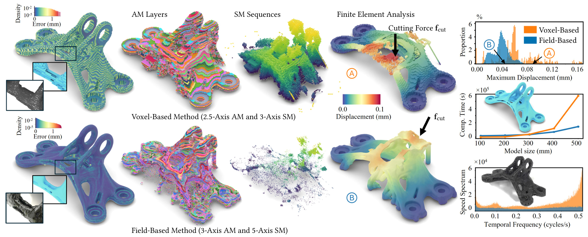

# Field Optimization for Scalable and Distortion-Aware Process Planning in Hybrid Additive-Subtractive Manufacturing


[Yongxue Chen](https://yongxue-chen.github.io/), Tao Liu, Aoran Lyu, Yu Jiang, Neelotpal Dutta, and [Charlie C.L. Wang](https://mewangcl.github.io/)<sup>&dagger;</sup>, "[Field Optimization for Scalable and Distortion-Aware Process Planning in Hybrid Additive-Subtractive Manufacturing](https://yongxue-chen.github.io/hybManuFieldOpt/hybManuFieldOpt_preprint.pdf)", ACM Transactions on Graphics (SIGGRAPH Asia 2026), Conditionally accepted. [[Project](https://yongxue-chen.github.io/hybManuFieldOpt/)] [[Paper](https://yongxue-chen.github.io/hybManuFieldOpt/hybManuFieldOpt_preprint.pdf)] [[Video](TODO)]<br>
<sup>&dagger;</sup>Corresponding author.

## Abstract
This paper presents a field-based optimization method for process planning in hybrid manufacturing, where the goal is to determine a feasible and efficient sequence of additive and subtractive operations for fabricating a target shape. Existing approaches rely on deterministic or discretized formulations, which lead to unoptimized fabrication time and make planning sensitive to voxel resolution. They also do not explicitly account for distortion in intermediate structures formed during manufacturing. To address these limitations, we represent manufacturing states using continuous fields, which scale naturally to models with large dimensions and fine geometric features while enabling smoother fabrication sequences. Based on this representation, we formulate process planning as a numerical optimization problem under multiple objectives, including final shape conformance, intermediate structural strength, manufacturing time, self-supporting and collision-free. Experimental results show that our method can generate distortion-aware process plans on a variety of models while substantially reducing fabrication time through up to a 72.6\% reduction in the volume of extra support.

## Repository Scope
This repository provides a PyTorch implementation of the continuous field optimization framework. Given an input STL model, the pipeline prepares support-aware geometry, builds voxel and/or neural SDF geometry representations, imports an initial operation field produced by the companion voxel-based planner, optimizes neural manufacturing fields, and postprocesses the optimized network into layers and tool paths.

The initial solution is generated by the voxel-based inverse-operation planner from the companion repository:

- `Yongxue-Chen/hybManuAccEro`: https://github.com/Yongxue-Chen/hybManuAccEro

This repository focuses on the continuous neural-field optimization stage and the downstream hybrid postprocessing stage. The trainable manufacturing fields use instant-NGP-style multi-resolution hash encodings implemented through `tiny-cuda-nn`. Large experiment outputs, training checkpoints, STL datasets, and generated GCode are intentionally excluded from the source release.

## Installation and Environment Setup

The primary setup below targets the NVIDIA GeForce RTX 5090 (Blackwell, compute capability 12.0). Create a clean environment and keep the PyTorch CUDA runtime, CUDA compiler, and `tiny-cuda-nn` target architecture aligned.

```bash
# 1. Create and activate the environment
conda create -n fieldopt_hm_rtx5090 python=3.10 pip git -y
conda activate fieldopt_hm_rtx5090

# 2. Install PyTorch for CUDA 13.0
python -m pip install torch --index-url https://download.pytorch.org/whl/cu130

# 3. Install the matching CUDA compiler/development toolkit
conda install -c nvidia cuda-nvcc=13.0 cuda-toolkit=13.0 -y
```

`cuda-toolkit` pulls in `gxx_linux-64`/`gcc_linux-64` as a dependency. On some systems, running the command above right after `conda activate <env>` in the same non-interactive shell makes conda's internal reactivation step misresolve `CONDA_PREFIX` to the base environment while running that package's activation script. This produces an error such as `ERROR: This cross-compiler package contains no program .../bin/x86_64-conda-linux-gnu-g++`, and can also corrupt the environment's `conda-meta/history` file (`conda env list` then reports `DirectoryNotACondaEnvironmentError`). If you hit this, install without first activating the environment:

```bash
conda install -n fieldopt_hm_rtx5090 -c nvidia cuda-nvcc=13.0 cuda-toolkit=13.0 -y
```

```bash
# 4. Configure the Conda CUDA 13 layout
export CUDA_HOME=$CONDA_PREFIX
export PATH=$CUDA_HOME/bin:$PATH
export CPATH=$CUDA_HOME/targets/x86_64-linux/include${CPATH:+:$CPATH}
export LIBRARY_PATH=$CUDA_HOME/targets/x86_64-linux/lib${LIBRARY_PATH:+:$LIBRARY_PATH}
nvcc --version

# 5. Install compatible build helpers
# tiny-cuda-nn currently imports pkg_resources (removed in setuptools >= 81),
# while PyTorch 2.13 requires setuptools >= 77.
python -m pip install setuptools==80.9.0 wheel ninja

# 6. Build tiny-cuda-nn for Blackwell sm_120
git clone --recursive https://github.com/NVlabs/tiny-cuda-nn
cd tiny-cuda-nn
git checkout 749dd70c5afc5a9dadb85e5652ed65d55e0ba187
git submodule update --init --recursive
cd bindings/torch
export TCNN_CUDA_ARCHITECTURES=120
export WITH_NINJA=1
export MAX_JOBS=8
python -m pip install . --no-build-isolation
cd ../../../
```

If `gxx_linux-64`/`gcc_linux-64` were installed in step 3, activating the environment overrides `CC`/`CXX` to point at the conda cross-compiler toolchain. Building `tiny-cuda-nn` with that toolchain can fail at the final link step with `ld: ... .preinit_array section is not allowed in DSO` (an incompatibility between the environment's newer binutils `ld` and its bundled older static `libpthread.a`). If you hit this, force the system compiler before building:

```bash
export CC=/usr/bin/gcc
export CXX=/usr/bin/g++
```

then re-run the `pip install . --no-build-isolation` command above.

```bash

# 7. Install this repository's Python dependencies
python -m pip install -r requirements.txt

# 8. Verify the installation
python -c "import torch; print('Torch:', torch.__version__, 'CUDA:', torch.version.cuda, 'GPU:', torch.cuda.get_device_name(0))"
python -c "import tinycudann, trimesh, pyvista, mesh_to_sdf, manifold3d; print('Core dependencies OK')"
```

After reopening a terminal, reactivate the environment. The CUDA target paths are needed when rebuilding CUDA extensions; normal project runtime only needs the activated environment.

```bash
conda activate fieldopt_hm_rtx5090
export CUDA_HOME=$CONDA_PREFIX
export PATH=$CUDA_HOME/bin:$PATH
export CPATH=$CUDA_HOME/targets/x86_64-linux/include${CPATH:+:$CPATH}
export LIBRARY_PATH=$CUDA_HOME/targets/x86_64-linux/lib${LIBRARY_PATH:+:$LIBRARY_PATH}
```

### Tested Environment

The commands above were tested from a newly created environment on 2026-07-18:

- OS: Ubuntu 24.04.4 LTS, Linux 6.17
- Conda environment: `fieldopt_hm_rtx5090`
- Python: `3.10.20`
- GPU: NVIDIA GeForce RTX 5090
- NVIDIA driver: `595.71.05`
- CUDA compute capability: `12.0`
- `TCNN_CUDA_ARCHITECTURES`: `120`
- PyTorch: `2.13.0+cu130`
- Torch CUDA runtime: `13.0`
- CUDA compiler: `nvcc 13.0.88`
- `tiny-cuda-nn`: `2.0`, source commit `749dd70c5afc5a9dadb85e5652ed65d55e0ba187`, native `_120_C` binding
- Key geometry packages: `trimesh 4.12.2`, `pyvista 0.48.4`, `pyvistaqt 0.12.0`, `manifold3d 3.5.2`, `mesh-to-sdf 0.0.15`, `embreex 4.4.0`, `rtree 1.4.1`, `libigl 2.6.2`
- Other tested packages: `numpy 2.2.6`, `PySide6 6.11.1`, `open3d 0.19.0`, `optuna 4.9.0`, `siren-pytorch 0.1.7`

## Usage

The full workflow consists of eight stages. The config file is created first because several later scripts load manufacturing parameters, normalization scale, model capacity, loss weights, and time limits from `configs/config_multi_field_<model>.py`.

Each demo stage is designed to run independently:

- `model_data/` contains the stable inputs and persistent results for the pipeline. Demo commands do not overwrite these files.
- `demo_runs/` contains outputs generated by the user while testing the README commands. This directory is disposable and ignored by Git.
- Steps 2–7 use the provided inputs under `model_data/`. The Step 8 demo explicitly reads the trained checkpoint generated by the fixed-weight demo in Step 7.

### 1. Create a Config File
The included bracket demo already uses `configs/config_multi_field_bracket.py`, so no new config is needed. Run all bracket commands with:

```bash
--model_name bracket
```

For any other model, create a matching config file. The `<model>` part must match the `--model_name` argument used by the scripts:

```bash
cp configs/config_multi_field_template.py configs/config_multi_field_your_model.py
```

Then use `--model_name your_model` for that model.

Edit the model config before running the pipeline. At minimum, check these values:

- `MAX_TIME`: the maximum value of the time domain, determined by the initial solution.
- `SCALE`: the target manufacturing size, corresponding to the longest edge of the model AABB.
- `WEIGHTS`: the weights assigned to the individual loss terms.
- `MANU_CONFIG`: the dimensions and parameter configuration of the manufacturing tools, especially `SMToolParas`.

The filename must follow `configs/config_multi_field_<model>.py`. The repository keeps `configs/__init__.py` so `configs` is an explicit Python package for imports such as `configs.config_multi_field_bracket`.

### 2. Prepare the Target Model and Optionally Run Preprocessing

Place the target STL under `model_data/target_shapes/`. The preprocessing program is optional. You may skip it and use the original target STL directly in the later voxelization or implicit-representation steps.

Run preprocessing only when the workflow needs removable supports, or when you want to test support generation. It produces a normalized body, removable supports, a combined body-and-support model, and a support-removal plan by performing the following operations:

1. Loads and validates the target mesh.
2. Translates the minimum corner of its AABB to the origin and scales its longest AABB edge to `1.0`.
3. Detects downward-facing overhang regions and samples support seed points.
4. Generates collision-aware removable supports using the tool parameters from the model config.
5. Boolean-unions the body and supports, repairs the exported meshes, and creates the ordered support-removal plan.

Default preprocessing input:

```text
model_data/target_shapes/<model>.stl
```

Default preprocessing test output:

```text
demo_runs/preprocessed/<model>/
```

#### Run the bracket demo

The repository already provides the bracket config and target STL:

```text
configs/config_multi_field_bracket.py
model_data/target_shapes/bracket.stl
```

From the repository root, run the default preprocessing demo command:

```bash
conda run -n fieldopt_hm_rtx5090 python preprocess.py --model_name bracket
```

This reads the provided target STL and writes newly generated test results to:

```text
demo_runs/preprocessed/bracket/
```

The generated files are `bracket_body_only.stl`, `bracket_support_only.stl`, `bracket_support.stl`, and `bracket_removal_plan.json`.

These files are optional test outputs. Later demo stages do not require them and can use the provided original bracket STL directly.

#### Adjust the overhang sampling density

The number of support seed points is controlled by `SAMPLE_DENSITY` near the top of `fieldopt/preprocessing/pre_main.py`:

```python
SAMPLE_DENSITY = 3000
```

The preprocessor computes the approximate number of seed points as:

```text
number of seeds = max(int(overhang area × SAMPLE_DENSITY), 10)
```

Increase `SAMPLE_DENSITY` when overhang regions do not receive enough supports. Decrease it when the supports are unnecessarily dense or preprocessing takes too long. Doubling the value approximately doubles the number of sampled support seeds for the same model.

A practical starting range is `1500` to `6000`: try `3000` first, inspect `<model>_support_only.stl`, and then adjust gradually. After changing the value, rerun the same preprocessing command; the files under `demo_runs/preprocessed/<model>/` are regenerated.

Or specify the input STL and output location explicitly:

```bash
conda run -n fieldopt_hm_rtx5090 python preprocess.py \
    --model_name bracket \
    --input-stl model_data/target_shapes/bracket.stl \
    --output-root demo_runs/preprocessed
```

`--output-root` is the parent directory that collects preprocessing results for multiple models. The program automatically appends `/<model_name>` to it. For example, `--output-root demo_runs/preprocessed` with `--model_name bracket` writes to `demo_runs/preprocessed/bracket/`.

Use `--output-dir` only when you want to provide the exact output directory yourself. It overrides the automatically constructed `<output-root>/<model_name>` path:

```bash
conda run -n fieldopt_hm_rtx5090 python preprocess.py \
    --model_name bracket \
    --input-stl model_data/target_shapes/bracket.stl \
    --output-dir demo_runs/preprocessed/bracket_test
```

The preprocessing outputs and their contents are:

```text
demo_runs/preprocessed/<model>/<model>_body_only.stl     normalized target body without supports
demo_runs/preprocessed/<model>/<model>_support_only.stl  generated removable supports without the body
demo_runs/preprocessed/<model>/<model>_support.stl       boolean union of the normalized body and supports
demo_runs/preprocessed/<model>/<model>_removal_plan.json ordered support-removal positions and tool axes
```

### 3. Create an Implicit Representation

The project provides two built-in implicit geometry representations:

- **Voxel implicit representation**: voxelizes the STL and saves a pure-PyTorch `H_gpu` artifact. Downstream code selects it with `--geometry_backend voxel_artifact`.
- **SIREN SDF representation**: trains a neural signed-distance field and saves a checkpoint. Downstream code selects it with `--geometry_backend siren` or `--geometry_backend neural_sdf`.

Both representations are loaded through the same geometry-backend interface and can be used by later optimization and postprocessing code. The voxel representation is the default and simplest option because it does not require neural-network training.

The bracket demo uses the author-provided preprocessed body-and-support model:

```text
model_data/preprocessed/bracket/bracket_support.stl
```

This file is provided under `model_data/`, so the third-step demo does not depend on the user running the optional preprocessing step. Results produced by the second-step demo remain under `demo_runs/` and are not used here.

#### Option A: voxel implicit representation (default)

Run the quick voxel demo:

```bash
conda run -n fieldopt_hm_rtx5090 python build_voxel_implicit.py \
    --model_name bracket \
    --stl_path model_data/preprocessed/bracket/bracket_support.stl \
    --voxel_resolution 128 \
    --output_path demo_runs/implicit_representations/bracket/bracket_voxel_implicit.pt
```

The demo uses resolution `128` so it finishes quickly. Increase `--voxel_resolution` for a finer production representation. The generated artifact can be selected by later commands with:

```bash
--geometry_backend voxel_artifact \
--geometry_artifact_path demo_runs/implicit_representations/bracket/bracket_voxel_implicit.pt
```

#### Option B: SIREN SDF representation

Run a short SIREN training job to verify checkpoint generation:

```bash
conda run -n fieldopt_hm_rtx5090 python -m fieldopt.geometry.sdf.train_sdf \
    --stl model_data/preprocessed/bracket/bracket_support.stl \
    --output-path demo_runs/implicit_representations/bracket/bracket_siren_sdf.pt \
    --epochs 2 \
    --batch_size 4096 \
    --n_surf 2048 \
    --n_vol 2048 \
    --val_samples 512
```

This short run tests the complete training, saving, loading, and query path; it is not intended to produce an accurate production SDF. For production use, increase the epoch and sample counts. The checkpoint can be selected by later commands with:

```bash
--geometry_backend siren \
--geometry_artifact_path demo_runs/implicit_representations/bracket/bracket_siren_sdf.pt
```

### 4. Voxelize the Model for `hybManuAccEro`

Voxelize the provided preprocessed body-and-support STL before running the external planner. The default bracket input is:

```text
model_data/preprocessed/bracket/bracket_support.stl
```

Run the default demo at voxel resolution `100`:

```bash
conda run -n fieldopt_hm_rtx5090 python -m fieldopt.geometry.voxel.voxelization \
    --model_name bracket
```

The command writes two files to `demo_runs/initial_fields/bracket/`:

```text
bracket_res100_voxels.txt
bracket_res100_centers.txt
```

`bracket_res100_voxels.txt` contains the voxel occupancy grid and is the direct model input for `hybManuAccEro`. `bracket_res100_centers.txt` contains the normalized voxel-center coordinates and AABB used to map the planner result back into the continuous pipeline.

Set the voxelization density with `--resolution`. It specifies the number of voxels along the normalized model AABB's longest edge:

```bash
conda run -n fieldopt_hm_rtx5090 python -m fieldopt.geometry.voxel.voxelization \
    --model_name bracket \
    --resolution 150
```

Demo outputs are disposable. When preparing persistent data for a new model, save the two files under `model_data/initial_fields/` with:

```bash
conda run -n fieldopt_hm_rtx5090 python -m fieldopt.geometry.voxel.voxelization \
    --model_name bracket \
    --resolution 100 \
    --output-root model_data/initial_fields
```

The script can optionally generate a diagnostic voxel-surface STL with `--write-surface`; this third file is for inspecting voxelization quality and is not an input to `hybManuAccEro`.

The following planning step uses the companion voxel-based project:

```text
https://github.com/Yongxue-Chen/hybManuAccEro
```

Use the voxel occupancy file as its model input:

```text
# Output generated by the default README command
demo_runs/initial_fields/bracket/bracket_res100_voxels.txt

# Pre-generated input provided by this repository
model_data/initial_fields/bracket/bracket_res100_voxels.txt
```

Do not pass `bracket_res100_centers.txt` or `bracket_res100_initial_fields.txt` as the model input to `hybManuAccEro`.

The repository also provides a complete pre-generated resolution-100 dataset so later demo stages can run independently:

```text
model_data/initial_fields/bracket/bracket_res100_voxels.txt
model_data/initial_fields/bracket/bracket_res100_centers.txt
model_data/initial_fields/bracket/bracket_res100_initial_fields.txt
```

The first two files are the pre-generated voxelization results described above. `bracket_res100_initial_fields.txt` is the result produced by `hybManuAccEro`. Its format is:

1. The first line is the inclusive starting voxel index `x_min,y_min,z_min`.
2. The second line is the inclusive ending voxel index `x_max,y_max,z_max`.
3. The third line is the ending operation sequence number.
4. Starting from the fourth line, each line is `x,y,z,AM_order,SM_order`, giving a voxel position and its additive- and subtractive-manufacturing sequence numbers.

Voxel indices start from `0`. An `AM_order` or `SM_order` greater than the ending sequence number on the third line is invalid and must not be treated as an operation in the initial solution.

The remaining `hybManuAccEro` and initial-field conversion instructions will be added after that workflow is finalized.

### 5. Update the Config Time Horizon

After `hybManuAccEro` generates the initial field, read the ending operation sequence number from the third line of:

```text
model_data/initial_fields/<model>/<model>_res<resolution>_initial_fields.txt
```

Calculate `MAX_TIME` with:

```text
MAX_TIME = ceil(0.02 × ending operation sequence number)
```

Write the resulting integer value in:

```text
configs/config_multi_field_<model>.py
```

For the provided bracket result, the third line is `9500`, so:

```text
ceil(0.02 × 9500) = 190
```

Therefore the bracket config contains:

```python
MAX_TIME = 190
```

The included `configs/config_multi_field_bracket.py` already uses `MAX_TIME = 190`.

### 6. Pretrain

Pretraining initializes the five neural fields from the author-provided initial solution. The default bracket inputs are:

```text
model_data/initial_fields/bracket/bracket_res100_initial_fields.txt
model_data/initial_fields/bracket/bracket_res100_centers.txt
model_data/preprocessed/bracket/bracket_support.stl
```

The initial-field file supplies the AM and SM operation orders, the centers file maps voxel indices to normalized coordinates, and the support STL supplies the normalized model AABB. The voxel occupancy file from step 4 is not read directly during pretraining.

Run a short one-epoch demo:

```bash
conda run -n fieldopt_hm_rtx5090 python main_pre_train.py \
    --model_name bracket \
    --resolution 100 \
    --pretrain-epochs 1 \
    --output-path demo_runs/pretrained_fields/bracket/bracket_pretrained_100.pth
```

The demo reads the files under `model_data/` and writes:

```text
demo_runs/pretrained_fields/bracket/bracket_pretrained_100.pth
```

This one-epoch command verifies the complete loading, training, and checkpoint-saving path; it is not intended to produce a converged pretrained model. Omit `--pretrain-epochs` to use the production epoch count from `configs/config_multi_field_<model>.py`.

For a production run, omit the demo epoch override and output path:

```bash
conda run -n fieldopt_hm_rtx5090 python main_pre_train.py \
    --model_name bracket \
    --resolution 100
```

The default production output is:

```text
model_data/pretrained_fields/bracket/bracket_pretrained_100.pth
```

The pre-generated bracket checkpoint uses the same path. Pretrained `.pth` checkpoints are large artifacts and are intentionally ignored by Git; they remain under the local `model_data/pretrained_fields/<model>/` layout rather than being uploaded to the repository.

All paths can be overridden explicitly:

```bash
conda run -n fieldopt_hm_rtx5090 python main_pre_train.py \
    --model_name <model> \
    --resolution <resolution> \
    --initial-field-path /path/to/initial_fields.txt \
    --centers-path /path/to/centers.txt \
    --stl-path /path/to/model_support.stl \
    --output-path /path/to/pretrained.pth
```

### 7. Optimize

Two optimization methods are available:

- run `main_optimize.py` with specified loss weights;
- use Bayesian optimization to search for loss weights.

#### Option 1: Optimize with Specified Weights

`main_optimize.py` performs joint optimization with a specified set of loss weights. By default, the loss weights and all training parameters, including the number of epochs, steps per epoch, batch size, and learning rate, are read from:

```text
configs/config_multi_field_<model>.py
```

For bracket, it automatically reads the results provided by the earlier steps:

```text
model_data/pretrained_fields/bracket/bracket_pretrained_100.pth
model_data/preprocessed/bracket/bracket_support.stl
model_data/implicit_representations/bracket/bracket_voxel_implicit.pt
```

Run the bracket demo:

```bash
conda run -n fieldopt_hm_rtx5090 python main_optimize.py \
    --model_name bracket \
    --resolution 100 \
    --tmp-model-path demo_runs/trained_fields/bracket/bracket_tmp.pth \
    --output-path demo_runs/trained_fields/bracket/bracket_final_trained.pth
```

The demo uses the complete training settings from `configs/config_multi_field_bracket.py`; it does not replace them with reduced test values. The default geometry backend is `voxel_artifact`, so the command above automatically loads the provided voxel implicit representation. Its first run may take longer while the CUDA structure solver is compiled.

The demo outputs are:

```text
demo_runs/trained_fields/bracket/bracket_tmp.pth
demo_runs/trained_fields/bracket/bracket_final_trained.pth
```

To use the SIREN SDF representation instead, add:

```bash
--geometry_backend siren
```

The matching `model_data/implicit_representations/bracket/bracket_siren_sdf.pt` checkpoint is selected automatically.

For a normal run, save the result to the default `model_data` location:

```bash
conda run -n fieldopt_hm_rtx5090 python main_optimize.py \
    --model_name bracket \
    --resolution 100
```

The default production output is:

```text
model_data/trained_fields/bracket/bracket_final_trained.pth
```

To override selected fixed weights, provide a JSON object. Terms not listed in the file retain their values from the model config:

```json
{
  "self_support": 35.0,
  "AM_Collision_Free": 69.0,
  "structure": 2.0
}
```

Run with:

```bash
conda run -n fieldopt_hm_rtx5090 python main_optimize.py \
    --model_name bracket \
    --weights-json /path/to/weights.json
```

This is fixed-weight optimization; it does not search for weights. Input and output paths can be overridden with `--pretrain-model-path`, `--stl-path`, `--geometry_artifact_path`, `--tmp-model-path`, and `--output-path`.

#### Option 2: Bayesian Weight Optimization

`bayesian_weight_optimizer_constrained.py` uses Optuna TPE to search the three free loss weights defined by `BAYESIAN_WEIGHT_SEARCH_SPACE` in the model config:

- `self_support`
- `AM_Collision_Free`
- `structure`

The optimizer applies these constraints to every trial:

```text
final_state = 1.0
operation_volume = 1.5
SM_Collision_Free = self_support * 0.1
```

Therefore, `BAYESIAN_WEIGHT_SEARCH_SPACE` should contain only the three free
weights. The recommended format is a stepped discrete range:

```python
BAYESIAN_WEIGHT_SEARCH_SPACE = {
    'self_support': {
        'type': 'discrete_range',
        'low': 1.0,
        'high': 100.0,
        'step': 1.0,
    },
    'AM_Collision_Free': {
        'type': 'discrete_range',
        'low': 1.0,
        'high': 100.0,
        'step': 1.0,
    },
    'structure': {
        'type': 'discrete_range',
        'low': 0.1,
        'high': 10.0,
        'step': 0.1,
    },
}
```

For each discrete range, `step` must be positive and `(high - low)` must be
divisible by `step`. The corresponding default values in `WEIGHTS` must lie
exactly on these grids because they are enqueued as the first Optuna trial.

Two other search-space formats are supported when continuous or explicitly
listed values are more appropriate:

```python
# Continuous range: (low, high, use_log_scale)
'self_support': (1.0, 100.0, False)
'structure': (0.01, 10.0, True)

# Explicit discrete candidates
'AM_Collision_Free': [10.0, 25.0, 50.0, 100.0]
```

`False` selects uniform continuous sampling and `True` selects logarithmic
continuous sampling. Do not include `final_state`, `operation_volume`, or
`SM_Collision_Free` in the search space: they are fixed or derived by the
constrained optimizer as shown above.

Each trial calls `main_optimize.py` with a sampled weight set. By default, the bracket workflow reads:

```text
model_data/pretrained_fields/bracket/bracket_pretrained_100.pth
model_data/preprocessed/bracket/bracket_support.stl
model_data/implicit_representations/bracket/bracket_voxel_implicit.pt
```

Run Bayesian optimization for bracket:

```bash
conda run -n fieldopt_hm_rtx5090 python bayesian_weight_optimizer_constrained.py \
    --model_name bracket \
    --resolution 100 \
    --output_dir demo_runs/trained_fields/bracket/bayesian_optimization
```

The number of trials defaults to 50. Each trial uses the epochs, steps per epoch, batch size, and learning rate from `configs/config_multi_field_bracket.py`. Use `--n_trials` to change the number of trials. The default output directory, when `--output_dir` is omitted, is:

```text
model_data/trained_fields/bracket/bayesian_optimization
```

The directory contains the Optuna study database, the best weights, trial history, and the best trained model. Use `--resume` with the same output directory to continue an existing study.

The input paths can be overridden with `--pretrain-model-path`, `--stl-path`, and `--geometry_artifact_path`. The optional `--batch_size`, `--joint-epochs`, and `--steps-per-epoch` arguments override config values and are mainly useful for controlled tests.

### 8. Postprocess

Postprocessing converts the optimized neural fields into interleaved additive and subtractive layers and their manufacturing paths. It also predicts tool orientations and performs collision detection and avoidance.

To postprocess the bracket result produced by the fixed-weight demo in Step 7, run:

```bash
conda run -n fieldopt_hm_rtx5090 python postprocess.py \
    --model_name bracket \
    --model-path demo_runs/trained_fields/bracket/bracket_final_trained.pth \
    --output-path demo_runs/postprocessed/bracket/bracket_layers_paths.pt \
    --no-visualize
```

The command reads:

```text
demo_runs/trained_fields/bracket/bracket_final_trained.pth
model_data/preprocessed/bracket/bracket_support.stl
model_data/implicit_representations/bracket/bracket_voxel_implicit.pt
```

and saves the generated layers and paths to:

```text
demo_runs/postprocessed/bracket/bracket_layers_paths.pt
```

For a normal run using the default `model_data` locations, run:

```bash
conda run -n fieldopt_hm_rtx5090 python postprocess.py \
    --model_name bracket \
    --no-visualize
```

The default trained-model input and postprocessed output are:

```text
model_data/trained_fields/bracket/bracket_final_trained.pth
model_data/postprocessed/bracket/bracket_layers_paths.pt
```

The default geometry backend is the saved voxel implicit representation. Add `--geometry_backend siren` to use `model_data/implicit_representations/bracket/bracket_siren_sdf.pt` instead.

By default, the complete pipeline generates both AM and SM layers and paths and performs collision checking and avoidance. Useful optional modes are:

- `--layer-only`: generate layers without paths.
- `--sm-only`: generate only SM layers and paths.
- `--skip-collision-check`: generate raw paths without collision handling.
- omit `--no-visualize` to open the interactive visualizer.
- `--cached load`: load an existing `--output-path` instead of regenerating it.

Use `--model-path`, `--stl-path`, `--geometry_artifact_path`, and `--output-path` to override the default input and output files. Layer sampling can be controlled with `--grid-resolution`, `--am-coarse-count`, and `--sm-coarse-count`.

## Input and Output Formats

Persistent model-specific inputs and outputs belong under `model_data/`. Disposable outputs produced by the README demo commands belong under `demo_runs/`. Except for `target_shapes/`, each pipeline stage uses a model-named subdirectory.

```text
model_data/
  target_shapes/
    <model>.stl
  preprocessed/<model>/
    <model>_body_only.stl
    <model>_support_only.stl
    <model>_support.stl
    <model>_removal_plan.json
  voxelized/<model>/
    optional standalone voxelization and diagnostic surface files
  implicit_representations/<model>/
    <model>_voxel_implicit.pt
    <model>_siren_sdf.pt
  initial_fields/<model>/
    <model>_res<resolution>_voxels.txt
    <model>_res<resolution>_centers.txt
    <model>_res<resolution>_initial_fields.txt
  pretrained_fields/<model>/
    <model>_pretrained_<resolution>.pth
  trained_fields/<model>/
    <model>_final_trained.pth
    bayesian_optimization/
  postprocessed/<model>/
    <model>_layers_paths.pt
```

The principal formats are:

| File | Format and role |
| --- | --- |
| `<model>.stl` | Triangular target mesh in STL format. |
| `<model>_body_only.stl` | Target body translated to the origin and normalized so the longest AABB edge is `1.0`. |
| `<model>_support_only.stl` | Removable support geometry without the target body. |
| `<model>_support.stl` | Boolean union of the normalized target body and supports; the default geometry input for later stages. |
| `<model>_removal_plan.json` | Ordered support-removal positions and tool axes produced by preprocessing. |
| `<model>_voxel_implicit.pt` | Pure-PyTorch voxel occupancy/query artifact used by the default geometry backend. |
| `<model>_siren_sdf.pt` | Neural signed-distance checkpoint used by the SIREN geometry backend. |
| `<model>_res<resolution>_voxels.txt` | Three-line voxel file: grid dimensions, the `0,0,0` origin placeholder, then the flattened binary occupancy array. This is the direct `hybManuAccEro` model input. |
| `<model>_res<resolution>_centers.txt` | First line contains the normalized AABB as `xmin,ymin,zmin,xmax,ymax,zmax`; remaining lines contain voxel-center coordinates as `x,y,z`. |
| `<model>_res<resolution>_initial_fields.txt` | First two lines contain inclusive start/end voxel indices, the third line contains the ending operation sequence number, and subsequent lines contain `x,y,z,AM_order,SM_order`. |
| `*.pth` | PyTorch state dictionary containing the five manufacturing neural fields. |
| `<model>_layers_paths.pt` | Serialized postprocessing dictionary containing interleaved layer meshes, per-layer path segments, tool orientations, scale, and coordinate offset. |

The preprocessing removal plan and the external initial field serve different purposes: the JSON file describes removal of generated supports, while the initial-field text file provides AM/SM operation orders for neural-field pretraining.

Large pretrained and trained `.pth` checkpoints are ignored by Git. The bracket target, preprocessed model, initial-field text files, and implicit-representation examples that are explicitly included in the repository remain trackable.

The equivalent disposable demo layout mirrors the relevant stages:

```text
demo_runs/
  preprocessed/<model>/
  implicit_representations/<model>/
  initial_fields/<model>/
  pretrained_fields/<model>/
  trained_fields/<model>/
  postprocessed/<model>/
```

## Repository Structure

```text
README.md                         project overview, installation, and usage
LICENSE                           repository license
requirements.txt                  Python dependencies after PyTorch/tiny-cuda-nn
preprocess.py                     user-facing preprocessing entry point
build_voxel_implicit.py           voxel implicit-representation builder
main_pre_train.py                 five-field pretraining entry point
main_optimize.py                  fixed-weight continuous optimization entry point
bayesian_weight_optimizer_constrained.py
                                  constrained Bayesian weight optimization
postprocess.py                    user-facing postprocessing entry point
evaluate_model.py                 optional trained-model evaluation utility
configs/                          model/task configuration files and template
fieldopt/                         internal Python package
  preprocessing/                  support generation and geometric preprocessing
  geometry/                       voxelization, SDF training, mesh utilities, geometry backends
    voxel/                        voxelization code
    sdf/                          neural/SIREN SDF and inclusion training
    mesh/                         STL repair, scaling, TPMS/lattice, mesh helpers
    smoothing/                    voxel-to-STL and mesh smoothing utilities
  models/                         instant-NGP-style hash-grid neural fields
  losses/                         optimization losses and structural losses
  postprocessing/                 layer/path generation and collision-aware postprocessing
  utils/                          data loading and training utilities
tests/                            environment verification utilities
docs/                             implementation and workflow documentation
model_data/                       model inputs and persistent artifacts by pipeline stage
demo_runs/                        disposable README command outputs, ignored by Git
assets/                           README and documentation assets
```

## Contact
- Yongxue Chen: yongxue.chen@manchester.ac.uk
- Charlie C.L. Wang: charlie.wang@manchester.ac.uk

## Notes
- Initial solution generation depends on `hybManuAccEro`: https://github.com/Yongxue-Chen/hybManuAccEro
- This repository includes the bracket target, config, preprocessed geometry, initial-field data, and implicit representations used by the documented workflow.
- Large trained weights, experiment logs, generated videos, GCode files, and other runtime outputs are not committed.

## Citation
If you use this code in academic work, please cite the corresponding paper.

```bibtex
@misc{fieldopt_hm,
  title  = {Field Optimization for Scalable and Distortion-Aware Process Planning in Hybrid Additive-Subtractive Manufacturing},
  author = {Chen, Yongxue and Liu, Tao and Lyu, Aoran and Jiang, Yu and Dutta, Neelotpal and Wang, Charlie C.L.},
  year   = {2026},
  note   = {ACM Transactions on Graphics (SIGGRAPH Asia 2026), Conditionally accepted}
}
```

## Supplement: RTX 4070 Ti / CUDA 12.8 Setup

Use this setup for the RTX 4070 Ti and other Ada GPUs with compute capability 8.9. Do not use `TCNN_CUDA_ARCHITECTURES=89` for the RTX 5090 setup above.

```bash
# 1. Create and activate the environment
conda create -n myenv python=3.10 -y
conda activate myenv

# 2. Install PyTorch with CUDA 12.8 support
python -m pip install torch --index-url https://download.pytorch.org/whl/cu128

# 3. Install the CUDA 12.8 compiler/toolkit
conda install -c nvidia cuda-nvcc=12.8 cuda-toolkit=12.8 -y

# 4. Point build tools to the active Conda CUDA toolkit
export CUDA_HOME=$CONDA_PREFIX
export PATH=$CUDA_HOME/bin:$PATH
export LD_LIBRARY_PATH=$CUDA_HOME/lib64:$LD_LIBRARY_PATH
echo $CUDA_HOME
nvcc --version

# 5. Install build helpers
python -m pip install --upgrade setuptools==69.5.1 wheel ninja

# 6. Build tiny-cuda-nn for Ada sm_89
git clone --recursive https://github.com/NVlabs/tiny-cuda-nn
cd tiny-cuda-nn/bindings/torch
rm -rf build/ dist/ *.egg-info
export TCNN_CUDA_ARCHITECTURES=89
export WITH_NINJA=1
python -m pip install . --no-build-isolation
cd ../../../

# 7. Install repository dependencies
python -m pip install -r requirements.txt

# 8. Verify the installation
python -c "import torch; print('Torch:', torch.__version__, 'CUDA:', torch.version.cuda, 'GPU:', torch.cuda.get_device_name(0) if torch.cuda.is_available() else 'CPU')"
python -c "import tinycudann, trimesh, pyvista, mesh_to_sdf, manifold3d; print('Core dependencies OK')"
```
