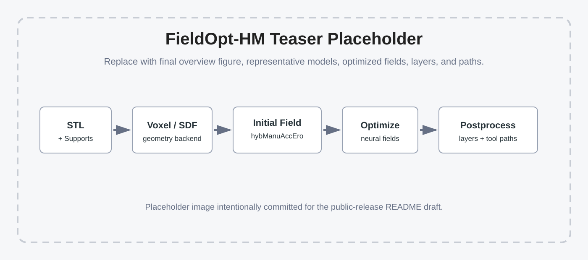

# FieldOpt-HM: Continuous Field Optimization for Hybrid Additive-Subtractive Manufacturing


Yongxue Chen, Tao Liu, Yuming Huang, Weiming Wang, Tianyu Zhang, Kun Qian, Zikang Shi, and Charlie C.L. Wang, "[TODO: Paper Title for Continuous Field Optimization in Hybrid Manufacturing](TODO)", TODO venue / preprint, TODO year.  
[[Project](TODO)] [[Paper](TODO)] [[Video](TODO)]

## Abstract
This repository provides a PyTorch implementation of a continuous-field optimization framework for hybrid additive-subtractive manufacturing. Given an input STL model, the pipeline first prepares support-aware geometry, converts the geometry into voxel and/or neural SDF representations, imports an initial operation field produced by the companion voxel-based planner, and then optimizes neural fields for manufacturable hybrid operations. The optimized network is postprocessed into layers and tool paths for downstream GCode generation.

The initial solution is generated by the voxel-based inverse-operation planner from the companion repository:

- `Yongxue-Chen/hybManuAccEro`: https://github.com/Yongxue-Chen/hybManuAccEro

This repository focuses on the continuous neural-field optimization stage and the downstream hybrid postprocessing stage. The trainable manufacturing fields use instant-NGP-style multi-resolution hash encodings implemented through `tiny-cuda-nn`. Large experiment outputs, training checkpoints, STL datasets, and generated GCode are intentionally excluded from the source release.

## Installation and Environment Setup

Create a fresh conda environment first, then install PyTorch, CUDA build tools, `tiny-cuda-nn`, and the Python dependencies in the same environment.

```bash
# 1. Create and activate the environment
conda create -n myenv python=3.10 -y
conda activate myenv

# 2. Install PyTorch with CUDA support
# If your CUDA/PyTorch requirement is different, replace this line with
# the command generated by https://pytorch.org/get-started/locally/.
pip install torch torchvision torchaudio --index-url https://download.pytorch.org/whl/cu128

# 3. Install CUDA compiler/toolkit into the conda environment
conda install -c nvidia cuda-nvcc=12.8 cuda-toolkit=12.8 -y

# 4. Point build tools to the active conda CUDA toolkit
export CUDA_HOME=$CONDA_PREFIX
export PATH=$CUDA_HOME/bin:$PATH
export LD_LIBRARY_PATH=$CUDA_HOME/lib64:$LD_LIBRARY_PATH
echo $CUDA_HOME
nvcc --version

# 5. Install build helpers
pip install --upgrade setuptools==69.5.1 wheel ninja

# 6. Build and install tiny-cuda-nn
git clone --recursive https://github.com/NVlabs/tiny-cuda-nn
cd tiny-cuda-nn/bindings/torch
rm -rf build/ dist/ *.egg-info
export TCNN_CUDA_ARCHITECTURES=89
export WITH_NINJA=1
pip install . --no-build-isolation
cd ../../../

# 7. Install this repository's Python dependencies
pip install -r requirements.txt

# 8. Install geometry acceleration packages for SDF and mesh queries
pip uninstall -y pyembree
pip install embreex rtree
python -c "import trimesh; print('Embree acceleration:', trimesh.ray.has_embree)"

# 9. Verify the core runtime
python -c "import torch; print('Torch:', torch.__version__, 'CUDA:', torch.version.cuda, 'GPU:', torch.cuda.get_device_name(0) if torch.cuda.is_available() else 'CPU')"
python -c "import tinycudann, pyvista, pyvistaqt, PyQt5, PySide6, trimesh, mesh_to_sdf, manifold3d, optuna, open3d, taichi, siren_pytorch, igl, stl; print('Core dependencies OK')"
```

After reopening a terminal, reactivate the environment and restore the CUDA paths before running training scripts:

```bash
conda activate myenv
export CUDA_HOME=$CONDA_PREFIX
export PATH=$CUDA_HOME/bin:$PATH
export LD_LIBRARY_PATH=$CUDA_HOME/lib64:$LD_LIBRARY_PATH
```

### Reference Test Environment

The commands above were tested on the following local setup. This is a reference configuration, not a strict requirement. For a different GPU or CUDA setup, adjust the PyTorch CUDA wheel and `TCNN_CUDA_ARCHITECTURES` accordingly.

- OS: Linux workstation
- Conda environment used for clean testing: `fieldopt_hm_test`
- Python: `3.10.20`
- GPU: NVIDIA GeForce RTX 4070 Ti
- GPU memory: `12282 MiB`
- NVIDIA driver: `580.159.03`
- CUDA compute capability: `8.9`
- `TCNN_CUDA_ARCHITECTURES`: `89`
- PyTorch: `2.11.0+cu128`
- Torch CUDA runtime: `12.8`
- CUDA compiler: `nvcc 12.8.93`
- `tiny-cuda-nn`: `2.0`
- Key geometry packages: `trimesh 4.12.2`, `pyvista 0.48.4`, `pyvistaqt 0.12.0`, `manifold3d 3.5.2`, `mesh-to-sdf 0.0.15`, `embreex 4.4.0`, `rtree 1.4.1`, `libigl 2.6.2`
- Other tested packages: `open3d 0.19.0`, `taichi 1.7.4`, `optuna 4.9.0`

## Usage

The full workflow consists of seven stages.

### 1. Prepare STL and Supports
Place the target STL model in `stlFiles/` or `demo_data/stl/`, then run the preprocessing code for the selected model.

```bash
conda run -n myenv python preprocess.py --model_name bracket
```

> TODO: replace this placeholder command with the finalized public demo command.

### 2. Voxelization and SDF Preparation
The support-augmented STL is used for voxelization and, optionally, neural SDF training.

To build a saved voxel geometry artifact:

```bash
conda run -n myenv python build_saved_h_gpu.py --model_name bracket
```

To train a neural/SIREN-style SDF checkpoint:

```bash
conda run -n myenv python -m fieldopt.geometry.sdf.train_sdf \
    --stl stlFiles/bracket.stl \
    --epochs 2000
```

> TODO: verify and simplify the public SDF training command after demo data is added.

### 3. Generate the Initial Field with `hybManuAccEro`
The initial solution is generated by the companion voxel-based planner:

```text
https://github.com/Yongxue-Chen/hybManuAccEro
```

Use `hybManuAccEro` to process the voxelized model and generate an operation schedule / initial field. Place the converted output under:

```text
initialFields/
```

or, for public examples:

```text
demo_data/initial_fields/
```

### 4. Configure a Model
Each run is controlled by a Python config file:

```text
configs/config_multi_field_<model>.py
```

For example:

```text
configs/config_multi_field_bracket.py
```

The training scripts load configs as Python modules named `configs.config_multi_field_<model>`.

### 5. Pretrain
Pretraining initializes the neural fields from the voxelized geometry and the initial field.

```bash
conda run -n myenv python main_pre_train.py --model_name bracket
```

### 6. Optimize
Run Bayesian optimization to search loss weights and call the main continuous optimizer:

```bash
conda run -n myenv python bayesian_weight_optimizer.py --model_name bracket
```

Or run the main optimizer directly:

```bash
conda run -n myenv python main_optimize.py --model_name bracket
```

### 7. Evaluate and Postprocess
Evaluate a trained checkpoint:

```bash
conda run -n myenv python evaluate_model.py \
    --model_name bracket \
    --model_path output/bracket_final_trained.pth \
    --batch_size 65536 \
    --n_batches 20 \
    --output_json output/bracket_eval_results.json
```

Generate layers and paths:

```bash
conda run -n myenv python postprocess.py \
    --model_name bracket \
    --model_path output/bracket_final_trained.pth
```

> TODO: confirm the final public postprocessing command once demo checkpoints and configs are fixed.

## Geometry Backend
Training, evaluation, Bayesian optimization, and postprocessing share the same geometry backend loader in `fieldopt/geometry/backend.py`.

Available backends:

- `voxel_artifact`: load `output/<model>_H_gpu.pt` (default).
- `voxel`: rebuild the voxel implicit function directly from STL.
- `siren` / `neural_sdf`: load a trained neural SDF checkpoint.

Examples:

```bash
# Default saved voxel artifact
conda run -n myenv python main_optimize.py --model_name bracket

# Rebuild voxel geometry from STL
conda run -n myenv python main_optimize.py \
    --model_name bracket \
    --geometry_backend voxel

# Use neural/SIREN SDF geometry
conda run -n myenv python main_optimize.py \
    --model_name bracket \
    --geometry_backend siren \
    --geometry_artifact_path demo_data/checkpoints/bracket_sdf.pt
```

## Input and Output Formats

### STL Input
- File type: `.stl`
- Default local folder: `stlFiles/`
- Public demo folder: `demo_data/stl/`

### Voxel / Initial Field Input
The initial field is generated externally by `hybManuAccEro` and then consumed by this repository.

- External repository: https://github.com/Yongxue-Chen/hybManuAccEro
- Local folder: `initialFields/`
- Public demo folder: `demo_data/initial_fields/`

> TODO: document the exact converted initial-field filename and tensor/text format used by `fieldopt/utils/data_loader.py`.

### Model Checkpoints and Geometry Artifacts
- Pretrained checkpoints: `output/<model>_pretrained.pth` or demo equivalent.
- Final optimized checkpoints: `output/<model>_final_trained.pth`.
- Saved voxel geometry artifacts: `output/<model>_H_gpu.pt`.
- Neural SDF checkpoints: `demo_data/checkpoints/<model>_sdf.pt` or a user-provided path.

### Postprocessing Outputs
Generated layers, paths, cached geometry artifacts, checkpoints, and related runtime files should be written under:

```text
output/
```

These folders are ignored by Git except for placeholder files.

## Repository Structure

```text
README.md                         project overview, installation, and usage
requirements.txt                  Python dependencies after PyTorch/tiny-cuda-nn
preprocess.py                     user-facing preprocessing entry point
postprocess.py                    user-facing postprocessing entry point
configs/                          model/task configuration files
fieldopt/                         internal Python package
  preprocessing/                  support generation and geometric preprocessing
  geometry/                       voxelization, SDF training, mesh utilities, geometry backends
    voxel/                        voxelization code
    sdf/                          neural/SIREN SDF and inclusion training
    mesh/                         STL repair, scaling, TPMS/lattice, mesh helpers
    smoothing/                    voxel-to-STL and mesh smoothing utilities
  models/                         instant-NGP-style hash-grid neural fields
  losses/                         optimization losses and structural losses
  postprocessing/                 layer/path generation and collision-aware postprocessing
  utils/                          data loading and training utilities
docs/                             workflow and release-maintenance documentation
demo_data/                        small public demo assets, to be added before release
examples/                         runnable examples and example-specific assets
assets/                           README and documentation assets
initialFields/                    local initial field placeholder
stlFiles/                         local STL placeholder
output/                           generated runtime artifacts, ignored by Git
```

## Example Results


Representative optimized fields, layers, tool paths, and fabrication results will be added before release.

## Contact
- Yongxue Chen: TODO
- Charlie C.L. Wang: TODO

## Notes
- Initial solution generation depends on `hybManuAccEro`: https://github.com/Yongxue-Chen/hybManuAccEro
- This repository does not commit large STL datasets, trained weights, experiment logs, generated videos, GCode files, or other runtime outputs.
- The public demo should include one small STL, one initial field, one config, and optional pretrained/SDF checkpoints.
- Platform and dependency versions should be pinned before the first public release.

## Citation
If you use this code in academic work, please cite the corresponding paper.

```bibtex
@misc{fieldopt_hm,
  title  = {TODO: Continuous Field Optimization for Hybrid Additive-Subtractive Manufacturing},
  author = {TODO},
  year   = {TODO},
  note   = {TODO}
}
```
